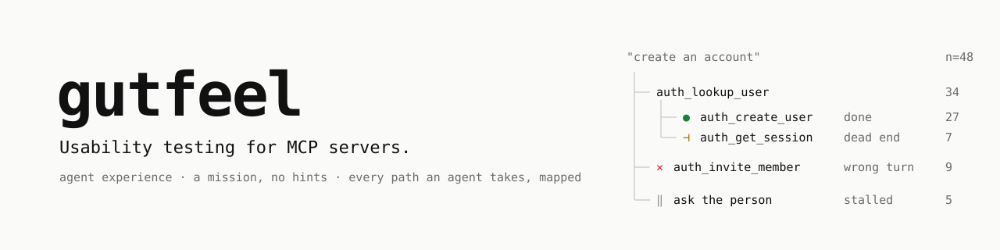
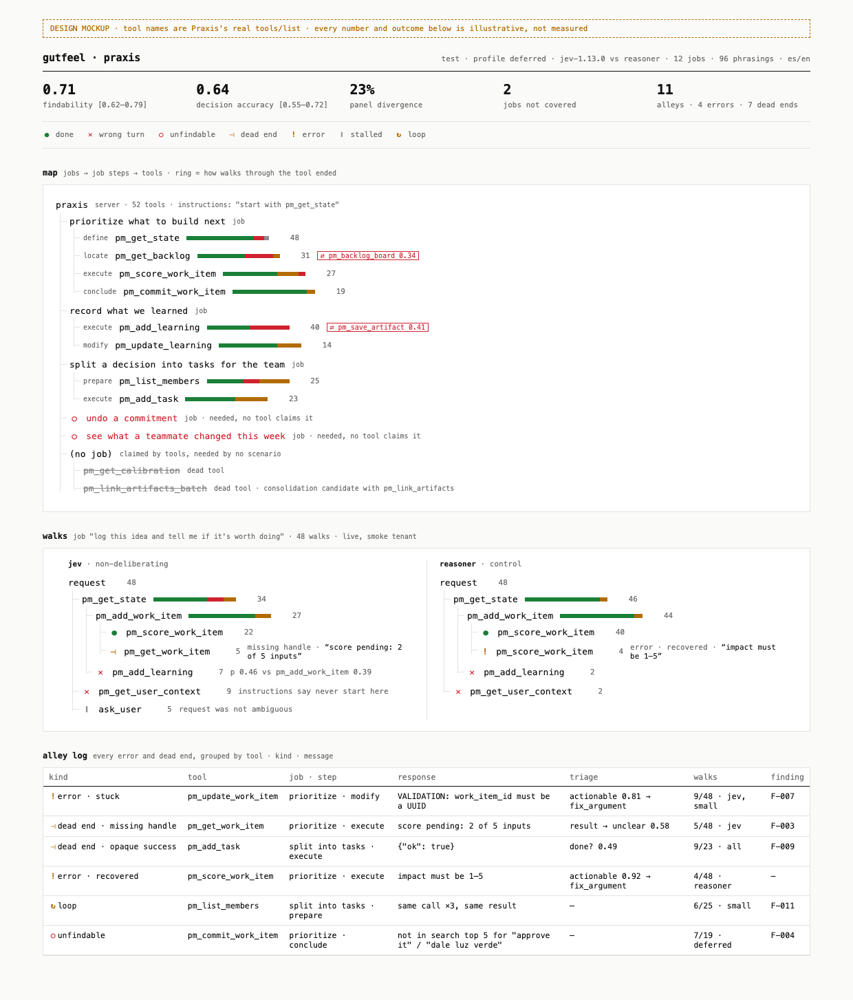
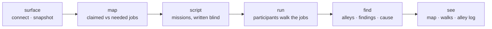

<p align="center">
  <picture>
    <source media="(prefers-color-scheme: dark)" srcset="docs/assets/banner-dark.svg">
    
  </picture>
</p>

<p align="center">
  <a href="#status"></a>
  <a href="LICENSE"></a>
  <a href="https://modelcontextprotocol.io"></a>
  <a href="docs/DESIGN.md#0-method-the-protocol-is-the-product"></a>
  <a href="CONTRIBUTING.md"></a>
</p>

<p align="center">
  <a href="docs/DESIGN.md"><b>Design</b></a> ·
  <a href="docs/DESIGN.md#0-method-the-protocol-is-the-product"><b>Method</b></a> ·
  <a href="docs/PANEL.md"><b>Panel review</b></a> ·
  <a href="#roadmap"><b>Roadmap</b></a> ·
  <a href="CONTRIBUTING.md"><b>Contributing</b></a> ·
  <a href="#citation"><b>Cite</b></a>
</p>

---

**gutfeel is usability testing for agents.** You give it an MCP server. It writes missions the way users actually ask for things (`create an account`, `who's on my team?`), with no hints, no steps and no tool names. Then it watches agents that don't deliberate try to complete them using only your server's own words.

What you get is a tree of every path they took: where they found the right tool, took a wrong turn, hit a dead end, got an error, stalled or looped. For each failure it shows the sentence in your descriptions that caused it, and it tests your fix before you ship it.

<p align="center">
  
  <br><sub><b>Design mockup.</b> The tool names are Praxis's real <code>tools/list</code>. Every number and outcome is illustrative, not measured.</sub>
</p>

> [!IMPORTANT]
> **Pre-alpha.** [`gutfeel live`](packages/live) runs today: first-click runs and real multi-step walks, drawn as they happen. The `npx gutfeel` CLI and the rest of the pipeline described here are in progress, and [DESIGN.md](docs/DESIGN.md) is the spec. Watch the repo to follow the first real reports.

## Contents

- [Why](#why)
- [How it works](#how-it-works)
- [What the participant sees](#what-the-participant-sees)
- [The tree](#the-tree)
- [What it measures](#what-it-measures)
- [Findings you can act on](#findings-you-can-act-on)
- [Strict by construction](#strict-by-construction)
- [How we know it works](#how-we-know-it-works)
- [Quickstart](#quickstart)
- [FAQ](#faq)
- [Related work](#related-work)
- [Roadmap](#roadmap) · [Contributing](#contributing) · [Citation](#citation)

---

## Why

**Frontier models don't save bad tool design. They hide it.** A reasoning model reads every description, rules out the wrong tools and works around confusing design. Your test passes. Then a cheaper model, a fast path, or an agent with 40 other servers loaded hits the same tools and misses.

**Agents often never see your descriptions.** Claude Code loads MCP tools on demand by default. The model starts with only tool names and server instructions, then searches. If your tool can't be found by name, its description is never read.

**Rewriting descriptions blindly can backfire.** In a study of 856 MCP tools, improved descriptions raised task success by a median of 5.85 points, but added 67% more steps and *made things worse in about 1 of 6 cases* ([Smelly, 2026](https://arxiv.org/abs/2602.14878)).

So you need to measure the behavior, the way UX researchers have measured websites for decades with **tree tests** and **first-click tests**. gutfeel applies the same method to agents.

---

## How it works



| Stage | What happens |
|---|---|
| **surface** | gutfeel connects over stdio, HTTP or OAuth (or reads a `tools.json`) and snapshots exactly what an agent would see. |
| **map** | It builds two job maps: what your tools *claim* to do, and what users actually *need* (from your README, docs and real requests). The difference shows jobs no tool covers and tools no job uses. |
| **script** | It writes missions **without ever seeing your tool descriptions**. A leakage check rejects any mission that borrows your wording. |
| **run** | A panel of participants walks each job, in parallel. Dry runs decide without executing anything. Live runs execute, against your own sandbox only. |
| **find** | Every failure is traced to its cause (the exact sentence), given a severity, and checked against a proposed fix. |
| **see** | A minimal, technical report: the map, the walks and the alley log. |

---

## What the participant sees

In a usability test, the participant gets a mission and no help. A moderator who explains the interface has ruined the session. **gutfeel is the moderator, so it says almost nothing.**

Everything a participant sees comes from one of four sources:

| Source | Example | Author |
|---|---|---|
| the mission | `create an account` | the user, in their own words |
| materials | `email: ana@example.com` | data the user would have on hand. Values, never instructions |
| your server | tool names, descriptions, schemas, instructions, results, errors | **you, verbatim. This is the interface under test** |
| the frame | `What do you do next?` | gutfeel: one neutral sentence, pinned and versioned, the same for every server |

No "you are a helpful agent", no "pick the best tool", no hints. **If a participant needs help to succeed, the missing help is the finding.**

<details>
<summary><b>The exact request one participant receives</b></summary>

```json
{
  "model": "jev-1.13.0",
  "state": "user: create an account\n      (email: ana@example.com)\n\ncalled: auth_lookup_user {\"email\":\"ana@example.com\"}\ngot:    {\"found\": false}",
  "questions": {
    "next": {
      "type": "choice",
      "instructions": "What do you do next?",
      "criteria": {
        "auth_create_user": "<your description and parameters, verbatim>",
        "auth_lookup_user": "<verbatim>",
        "ask_user": "Ask the person something",
        "answer_directly": "Reply without using a tool",
        "stop": "Stop"
      }
    }
  }
}
```

The frame's own influence is measured too. Every suite also runs under alternative neutral frames, and if the decisions change, the frame gets fixed before any result counts.
</details>

### The participants

The participants are a panel, not one model. A finding counts only when it holds up across phrasings, and every report shows which participants split from which.

| Participant | What it is | Role |
|---|---|---|
| `bm25` | Keyword search, the same mechanism behind tool search | Floor for findability. Free |
| `embed` | Embedding similarity | Free baseline |
| **`jev`** | [Jev](https://pydantic.dev/docs/ai/models/typesafe/), a calibrated classifier: it picks an option and never writes text | The default participant |
| `small` | A small open model, or Haiku with thinking off | The cheap agent |
| `reasoner` | A reasoning model | Control group: the expert user |

Each participant sees your tools the way real clients present them:

| Profile | What it shows |
|---|---|
| `deferred` | Tool names and server instructions, then a search, then the 5 best matches (Claude Code's default) |
| `upfront` | Every tool, in full |
| `crowded` | Your tools mixed in with a pack of tools from popular servers |

---

## The tree

Every walk ends in one of these states. The UI is monochrome: color only ever marks state, and every state has a glyph, so the report still reads in grayscale.

| | State | Meaning |
|---|---|---|
| `●` | **done** | Mission accomplished |
| `✕` | **wrong turn** | Picked a tool that isn't on any acceptable path |
| `○` | **unfindable** | The right tool never appeared in the search results, so the agent never saw it |
| `⊣` | **dead end** | The tool worked, but its result gave no way forward: empty, missing the ID the next tool needs, truncated with no cursor, or a bare `{"ok":true}` |
| `!` | **error** | The tool failed. Split into *recovered* and *stuck*, plus whether the message says what to do next |
| `‖` | **stalled** | Asked the person, or gave up, when the job needed a tool |
| `↻` | **loop** | Repeated the same call and learned nothing new |

The report has three views:
- **Map:** your server as a tree of jobs, then job steps, then tools. Gaps and confused pairs are marked.
- **Walks:** one tree per job, with the non-deliberating participants and the reasoner side by side.
- **Alley log:** every error and dead end, with the real message.

---

## What it measures

| Metric | Question |
|---|---|
| **Findability** | Does search return the right tool in its top 5? |
| **Decision accuracy** | Given the correct steps so far, is the next pick in the acceptable set? |
| **Distinguishability** | Which tools get confused with each other, and by how much? |
| **Argument legibility** | Does each value go into the right parameter? |
| **Result comprehension** | Reading a real result, does it tell done, partial and failed apart? |
| **Error triage** | Faced with an error: retry, fix an argument, switch tools, ask, or stop? |
| **Silent failures** | Does it notice empty, truncated or opaque results? |
| **Panel divergence** | Where do the non-deliberating participants split from the reasoner? |
| **Completion · lostness · recovery** | Live runs only, checked against real state |

Every number comes with a 95% confidence interval, bootstrapped by job and corrected for chance. With fewer than 30 jobs, gutfeel shows findings but no summary numbers.

---

## Findings you can act on

```
F-007 · severity 3 · 9/48 walks [CI] · error · stuck
Mission:      "cambia la prioridad de esa idea"   (Spanish: "change that idea's priority")
Where:        pm_update_work_item · job step: modify
Response:     VALIDATION: work_item_id must be a UUID
Participants: fails in jev, small · passes in reasoner
Cause:        the previous result returned a slug, not the UUID this tool requires (missing handle)
Fix:          return work_item_id in pm_add_work_item's result
Verified:     rerun → 46/48 · no regressions in 11 neighboring jobs or in the reasoner
```

<sub>Format example. The values are illustrative.</sub>

The **Verified** line is the point. gutfeel reruns your proposed fix before you ship it, so you're not one of the 1 in 6 rewrites that make things worse. It also reports **structural** findings, not just wording: tools that should be merged, IDs missing from results, name collisions with other servers, and too many tools.

---

## Strict by construction

An AX eval is only worth anything if every run follows the same method. In gutfeel, **the harness enforces the method**: a run that breaks a rule ends as `invalid`, not as a number.

- **Pre-registered.** A `protocol@1` file (missions, frame, pinned participant versions, analysis plan, exclusion rules) is frozen and hashed before the first decision. The hash is printed on every report.
- **Blinded roles.** The mission writer never sees your tools, and labelers never see participant decisions. This is enforced in code.
- **Controls in every run.** One server with planted defects, which gutfeel must catch, and one clean server, which gutfeel must pass. If either check fails, the run doesn't count.
- **Pilot first.** Two jobs check the frame, leakage, limits and noise floor before the full run.
- **Invalid isn't failed.** Timeouts, rate limits and harness errors never count against your server. Above 5% invalid walks, the whole run is invalid.
- **Reproducible.** Every input is hashed into the run, and `gutfeel replay` reproduces a run decision by decision.

Read the full [method](docs/DESIGN.md#0-method-the-protocol-is-the-product). Every walk is recorded in full (what the participant saw, what it answered, what the hands sent, what the server returned) so a person or a more capable agent can audit any path: see [AUDIT.md](docs/AUDIT.md).

---

## How we know it works

A measurement nobody has validated is a vibe with a number on it. Before any public report, gutfeel has to pass these experiments, and we publish the results whichever way they go:

| | Question | Passes if |
|---|---|---|
| **E1** | Do gutfeel-guided fixes help real agents on held-out tasks? | Small and mid-size models improve by at least 5 points; frontier models lose no more than 1 point; tokens grow by no more than 15% |
| **E2** | Which participant best predicts real agents' failures? | Jev beats embeddings by at least 0.05 AUROC, or Jev stops being the default |
| **E3** | Is it reliable? | Rank correlation (Kendall τ) of at least 0.9 between runs and 0.8 between scenario sets; calibration error below 0.1 |
| **E4** | Does dry accuracy predict live completion? | r ≥ 0.7 |
| **E5** | Does it catch deliberate damage? | Scores drop step by step as descriptions get worse |

**AX reports, not rankings.** We'll publish reports on popular public MCP servers: dry mode only, open methods, a 14-day preview for maintainers with a right of reply, and no letter grades. Prisma maintains an MCP server (Praxis). Its report goes first, under the same rules.

---

## Quickstart

> [!WARNING]
> **Live mode runs your tools for real. Point it at a sandbox or test environment, never at production data.**
> A live walk creates, updates and reads whatever the participant decides, using the account you connect. Use a separate environment or a disposable test account seeded for the purpose, and expect test records to be left behind. gutfeel only runs tools on its allowlist (read-only plus additive writes), it logs every write so you can clean up, and it won't start a live walk until you confirm the target is a sandbox. Those guards limit damage; they don't make production safe. Dry runs execute nothing.

> [!NOTE]
> This is the interface we're building toward. It doesn't run yet; see [Status](#status).

```bash
npx gutfeel https://mcp.your-server.com          # remote server (OAuth supported)
npx gutfeel -- node dist/server.js               # local stdio server
npx gutfeel --tools tools.json                   # just a tool list
```

- `gutfeel scan` is exploratory, needs no setup and gives **no score**.
- `gutfeel test` runs a labeled, pre-registered suite.
- `gutfeel diff` shows which decisions flipped between two versions.
- `gutfeel replay` reproduces a past run.

**In CI**, every PR that changes your tools gets a comment listing which decisions flipped, the sentence that caused each one, and the participants affected.

```yaml
- uses: huayaney-exe/gutfeel@v0
  with:
    server: node dist/server.js
    suite: ./gutfeel/
```

**Keys** are optional and never stored. `bm25`, `embed` and `small` run locally. Add `TYPESAFE_API_KEY` for Jev and `ANTHROPIC_API_KEY` for the reasoner.

---

## FAQ

<details><summary><b>Why a model that doesn't reason?</b></summary>

Because reasoning hides the problem. A reasoning model is an expert user: it compensates for unclear design. A participant that only decides shows what's findable and distinguishable *from your words alone*. It isn't the only participant, though. The panel and the reasoner control are there so a quirk of one model never becomes your finding.
</details>

<details><summary><b>Will it run my tools?</b></summary>

Not unless you ask it to. Dry mode, the default, only records decisions. Live mode only runs tools annotated `readOnlyHint: true` or tools you allow explicitly, and it's meant for your own sandbox.
</details>

<details><summary><b>Is this a leaderboard?</b></summary>

No. No rankings and no letter grades. Public AX reports come only after validation (E1–E5), with a preview and a right of reply for maintainers.
</details>

<details><summary><b>Do I need Jev access?</b></summary>

No. The local participants run for free. Jev is the default because it's fast, cheap and calibrated, but it has to earn that place in E2.
</details>

<details><summary><b>Only MCP?</b></summary>

MCP comes first. The core reads a tool list, so OpenAI function calling and agent cards are a natural next step.
</details>

<details><summary><b>Why "gutfeel"?</b></summary>

Because the test is your server's first impression on an agent that goes with its gut. And "AX vibe check" deserved an instrument behind it.
</details>

---

## Related work

| | What it does | How gutfeel differs |
|---|---|---|
| [AgentDX](https://github.com/agentdx/agentdx) | Benchmarks tool selection, parameters and recovery; 0–100 score | Writes its scenarios from your tool definitions. gutfeel writes missions blind |
| [mcp-evals](https://github.com/mclenhard/mcp-evals) | LLM-as-judge evals, GitHub Action | Judges outputs. gutfeel tests the surface, decision by decision |
| [mcpx](https://github.com/sameenchand/mcpx), mcplint | Static rules, letter grades | Rules check the text. gutfeel measures behavior |
| MCP-Bench, MCP-Universe, MCPMark | Model benchmarks | Fix the tools and compare models. gutfeel fixes the participants and compares designs |
| [Smelly (2026)](https://arxiv.org/abs/2602.14878) | Description smells across 856 tools | gutfeel checks whether a fix actually helps before you ship |

**Method lineage:** tree testing; first-click testing (Bailey & Wolfson, 2009); cognitive walkthrough (Wharton et al., 1994); lostness (Smith, 1996); severity ratings (Nielsen, 1995); the universal job map (Bettencourt & Ulwick, 2008).

**Guidance followed:** Anthropic's [Writing tools for agents](https://www.anthropic.com/engineering/writing-tools-for-agents) and [Demystifying evals for AI agents](https://anthropic.com/engineering/demystifying-evals-for-ai-agents): grade the outcome, not one fixed path.

---

## Roadmap

<a id="status"></a>**Status: pre-alpha, design complete, code starting.**

- [x] Design, method and panel review ([DESIGN](docs/DESIGN.md) · [PANEL](docs/PANEL.md))
- [ ] **C1** Contracts (`protocol@1`, `surface@1`, `scenario@1`, `frame@1`, `run@1`, `finding@1`), metrics, confidence-interval math
- [ ] **C1b** Control servers: planted defects and clean
- [ ] **C2–C3** Surface connectors · participant panel · profiles
- [ ] **C4–C5** Job maps · blind missions · dry runner · `scan`
- [ ] **C6** Report UI: map, walks, alley log
- [ ] **C7–C8** Live runner · findings · verified fixes
- [ ] **C9** First runs: Praxis, Linear, Supabase
- [ ] **C10** Validation E1–E5, published, including the failures

---

## Contributing

The most valuable contributions aren't code. They're **missions** and **suites**: real requests, in real words and in many languages, for the MCP servers you use. Read [CONTRIBUTING.md](CONTRIBUTING.md) for the method rules. Maintainers disputing a published AX report have [their own issue form](.github/ISSUE_TEMPLATE/report_dispute.yml), and disputes are handled first.

## Citation

If you use gutfeel in research, please cite it (see [CITATION.cff](CITATION.cff)):

```bibtex
@software{gutfeel2026,
  title  = {gutfeel: usability testing for agents},
  author = {Huayaney, Luis Eduardo},
  year   = {2026},
  url    = {https://github.com/huayaney-exe/gutfeel},
  note   = {Greenhouse Labs LLC}
}
```

## License

[MIT](LICENSE) © 2026 Greenhouse Labs LLC

<p align="center"><sub>Made in LATAM by <a href="https://getprisma.lat">Prisma</a> · Greenhouse Labs LLC</sub></p>
