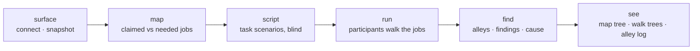

# gutfeel · design

Status: pre-alpha design, 2026-10-07. This document is the spec the code follows. The README is the public promise; this file explains how we keep it.

---

## 1. What gutfeel answers

For an MCP server and the jobs its users bring to it:

1. **The map.** Which jobs does the server cover, at which job step, with which tools? Which jobs have no tool, and which tools serve no job?
2. **The walks.** When an agent that doesn't deliberate tries each job, where does it go? Where does it take a wrong turn, hit a dead end, get an error, stall, or loop?
3. **The cause and the fix.** Which sentence of which description, schema or error message caused each failure, and does a proposed rewrite fix it without breaking anything else?

Everything gutfeel shows is one of these three, drawn as a tree.

---

## 2. Pipeline



Each stage reads and writes a versioned contract (§6), so it can be rerun, cached, swapped or inspected on its own.

| Stage | Input | Output | Uses a generative model? |
|---|---|---|---|
| surface | URL, stdio command, or `tools.json` | `surface@1` | No |
| map | `surface@1` + outside sources (README, docs, real requests) | `jobmap@1` | Yes (mapper) |
| script | needed jobs only (**never** the tool descriptions) | `scenario@1[]` | Yes (scriptwriter) |
| run | surface + scenarios + participants + profile + mode | `event@1` stream → `run@1` | Only "hands" in live mode |
| find | `run@1` | `finding@1[]` | No (ablation reruns participants) |
| see | everything above | report UI + static HTML | No |

---

## 3. The trees

The user-facing core. Two kinds of tree, one color system.

### 3.1 State colors and glyphs

The UI is monochrome. Color is used **only** to show state, and every state also has a glyph, so it reads in grayscale and for color-blind users.

| State | Glyph | Color | Meaning | Dry | Live |
|---|---|---|---|---|---|
| **done** | `●` | green | The goal was reached: the path is complete within the acceptable sets (dry) or the state check passed (live) | ✓ | ✓ |
| **wrong turn** | `✕` | red | Picked a tool outside the acceptable set for this step | ✓ | ✓ |
| **unfindable** | `○` | red, dashed | The right tool never made the search's top 5, so the agent never saw it (`deferred` profile only) | ✓ | ✓ |
| **dead end** ("closed alley") | `⊣` | amber | The tool ran without error, but its result gave no way forward (§3.4) | fixtures | ✓ |
| **error** | `!` | amber | The tool returned an error. The branch splits into *recovered* (the walk continues) and *stuck* | fault injection | ✓ |
| **stalled** | `‖` | gray | The participant stopped, asked the user or answered directly when the job needed a tool. (If stopping was correct, that's **done**.) | ✓ | ✓ |
| **loop** | `↻` | amber | The same call with the same arguments, repeated with no new information | — | ✓ |

The taxonomy above is a starting hypothesis, not a fixed list. Before it gets locked, the first ~100 live traces from C9 are read by hand and coded bottom-up: label what actually went wrong, then group the labels. States that never show up get merged, and failure types that don't fit get added. Classify from the data, not from the spec.

### 3.2 The map tree: the server as a tree

This is the MCP drawn the way tree testing draws a site's navigation. It's built from `jobmap@1`.

```
server
├── job: "prioritize what to build next"
│   ├── step: define        → pm_get_state
│   ├── step: locate        → pm_get_backlog · pm_backlog_board        (confused pair ⇄)
│   ├── step: execute       → pm_score_work_item
│   └── step: conclude      → pm_commit_work_item
├── job: "record what we learned"
│   └── step: execute       → pm_add_learning · pm_save_artifact       (confused pair ⇄)
├── job: "hand work to a teammate"            ○ needed, not covered
└── (no job)                → pm_render_diagram                        ◌ dead tool
```

- **Jobs** come from the *needed* map. A job the server doesn't cover is drawn hollow (`○`).
- **Steps** follow Ulwick's universal job map: define, locate, prepare, confirm, execute, monitor, modify, conclude. Only the steps a job actually uses are drawn.
- **Tools** hang under the steps that claim them. Tools that no needed job reaches go under `(no job)` as dead tools (`◌`).
- **Heat:** each tool node carries a ring split by state, showing what happened to every walk that passed through it. A mostly red or amber ring means the tool is where walks break.
- **Confused pairs** are drawn as `⇄` arcs between sibling tools, thicker for more confusion.

### 3.3 The walk tree: one job, every attempt

This is tree testing's *pietree*, applied to agents. One tree per job, combining every phrasing × participant × profile.

```
"log this idea and tell me if it's worth doing"            n=48
├── pm_get_state                       ▰▰▰▰▰▰▰▱▱▱ 34
│   ├── pm_add_work_item               ▰▰▰▰▰▰▱▱▱▱ 27
│   │   ├── pm_score_work_item         ● done 22
│   │   └── pm_get_work_item           ⊣ dead end 5   "score not computed until inputs complete"
│   └── pm_add_learning                ✕ wrong turn 7
├── pm_get_user_context                ✕ wrong turn 9   (server instructions say: never start here)
└── ‖ stalled: asked the user 5
```

- **Nodes** are the tools chosen at each step. Edge width is the share of walks.
- **Each node's ring** shows how the walks through it ended.
- **Leaves** use the glyphs from §3.1. Dead ends and errors show the *actual* response or error text, cut to one line, plus the error-triage verdict ("says what to do next: p=0.12").
- **Filters:** participant (split view: Jev vs reasoner side by side), profile, language, phrasing.
- **Dry mode semantics:** at step *k* the participant is given the *correct* steps 1…k−1 and decides only step *k*. So dry walk trees are first-click trees: every branch is one wrong decision from the correct path, and there's no fake history after a mistake. Full multi-step walks, along with dead ends, errors and loops, exist only in live mode or on replayed real results.

### 3.4 Dead ends: how a "closed alley" is detected

A step is a dead end when the tool succeeded but the participant can't move forward. The rules, checked in order:

1. **Empty:** the result is empty, and the job's next acceptable step needs something from it.
2. **Missing handle:** the next acceptable tool requires an identifier (an `*_id` or `uuid` parameter) that doesn't appear in the result.
3. **Truncated:** the result says it's partial (`truncated`, `has_more`, a next cursor) and gives no way to continue.
4. **Opaque success:** the result is a bare `ok` or `{}` with nothing confirming the state change. The result-comprehension probe ("is the job done?") also fails here.
5. **Participant judgement:** the participant's `done` / `partial` / `failed` read on the result disagrees with the state check.

Each dead end records which rule fired. The **alley log** lists them all.

### 3.5 The alley log

This is the table version of every amber and red leaf, the list you asked for: errors and closed alleys.

| Column | Example |
|---|---|
| kind | `error · stuck` |
| tool | `pm_update_work_item` |
| job · step | prioritize · execute |
| response (one line) | `VALIDATION: work_item_id must be a UUID` |
| triage verdict | says what to do: 0.81 → `fix argument work_item_id` |
| rule | — (errors) / `missing-handle` (dead ends) |
| frequency | 9/48 walks · in Jev, small · not in reasoner |
| finding | F-007 |

Rows group by `(tool, kind, normalized message)`, so one bad error message shows up as one row with a count.

---

## 4. Participants and profiles

### 4.1 The panel

```ts
interface Participant {
  id: 'bm25' | 'embed' | 'jev' | 'small' | 'reasoner' | string
  version: string                                  // recorded in every run
  decide(q: DecisionInput): Promise<Decision>      // full distribution, not just the winner
}
```

| Participant | How it decides | Cost |
|---|---|---|
| `bm25` | Keyword search between the request and each rendered tool | Free, local |
| `embed` | Cosine similarity between embeddings of the request and each tool | Free, local (small open embedder) |
| `jev` | A `choice` question over the options (§4.3) | BYOK `TYPESAFE_API_KEY` |
| `small` | A small model with thinking off; distribution estimated from N samples | BYOK or local |
| `reasoner` | A reasoning model, the control group; N samples | BYOK `ANTHROPIC_API_KEY` |

Every finding reports which participants it shows up in. **Panel divergence**, the headline signal, is any decision where the non-deliberating participants split from the reasoner.

### 4.2 Options always include not using a tool

Every decision's options are the visible tools **plus** `ask_user`, `answer_directly` and `stop`. Picking one of those when the job needs a tool counts as **stalled**. Picking one when the scenario says that's correct (for example, the request is ambiguous) counts as **done**. Without these options, a sensible "ask first" would be scored as a wrong turn.

### 4.3 Jev in practice

Endpoint `POST https://api.typesafe.ai/v1/systemone`, auth `Authorization: Bearer $TYPESAFE_API_KEY`, model **pinned** (e.g. `jev-1.13.0`, never `jev-latest`, so runs can be reproduced). One request per step asks several questions about the same state:

| Question | Type | Criteria |
|---|---|---|
| `next` | `choice` | `{ tool_name: rendered description, ask_user, answer_directly, stop }` |
| `done` | `noul` | "The job is complete given the last result" |
| `result` | `choice` | `done · partial · failed · unclear` |
| `triage` (after errors) | `choice` | `retry · fix_argument · switch_tool · ask_user · stop` |
| `actionable` (after errors) | `noul` | "The error says what to do next" |

Limits to design around: about 32k tokens for the state plus the longest question, 255 options, 1,200 requests per minute. A server with more tools than fit is a finding in itself, so gutfeel reports it and applies the `deferred` profile.

### 4.4 Presentation profiles

| Profile | What the participant sees | Mirrors |
|---|---|---|
| `deferred` | Tool names + server `instructions` → a search (BM25 over name, description and parameter names) → the 5 top tools rendered in full | Claude Code's default tool search |
| `upfront` | Every tool, rendered in full (name, description, flattened parameters) + `instructions` | Direct API use, small servers |
| `crowded` | `upfront` plus a pinned pack of tools from popular servers (GitHub, Notion, Linear…) | A real agent with several servers loaded |

The renderer is one function shared by every participant, so they all see exactly the same text.

---

## 5. Modes

| | `scan` | `test` | `test --live` | `diff` |
|---|---|---|---|---|
| Scenarios | Generated, blind, no labels | Labeled suite (acceptable-path sets, held-out split) | Labeled suite | Same as the base run |
| Executes tools | No | No (fixtures and fault injection for the evaluation probes) | **Yes**, in your sandbox | — |
| Trees | Map tree + first-click walk trees | Same, with labels | Full walks: dead ends, errors, loops | Flipped decisions on the trees |
| Gives a score | **No**, diagnostics only | Yes, with confidence intervals | Yes, completion by state | Count of flips above the noise floor |

**The live guard.** A tool runs only if it's annotated `readOnlyHint: true`, or explicitly allowed with `--allow tool,tool`. Annotations from untrusted servers are hints, not guarantees (per the MCP spec), so the allowlist is the actual protection, and live mode prints it before starting.

**Hands.** In live mode, arguments are filled in by a constrained generative model that sees the task, the history and that one tool's schema. Hands never choose the tool. When an argument is wrong, the failure is tagged `argument`, not `decision`, so participants aren't blamed for the hands' mistakes.

---

## 6. Contracts

All contracts are defined in `packages/core` as zod schemas, with JSON Schema exported for other languages. Every document carries `"$contract": "name@version"`.

| Contract | Key fields |
|---|---|
| `surface@1` | `server {name, version, transport, instructions}` · `tools[] {name, description, inputSchema, annotations}` · `hash` · `captured_at` |
| `jobmap@1` | `jobs[] {id, statement (verb + object + context, no solution words), source: needed\|claimed, steps[] {ulwick_step, tools[]}}` · `uncovered[]` · `dead_tools[]` · `overlaps[]` |
| `scenario@1` | `id, job_id, persona, context, phrasings[] {text, lang}, acceptable_paths[][] (sets per step), success {kind: path\|state, check}, should_stall?, leakage_score` |
| `event@1` | `run_id, walk_id, step, participant, profile, options_hash, distribution {option: p}, chosen, call? {tool, args}, result? {ok, excerpt, error?}, state: done\|wrong\|unfindable\|dead_end\|error\|stalled\|loop\|continue, rule?` |
| `run@1` | `surface_hash, suite_hash, participants[] {id, version}, profile, mode, walks[], metrics {…, ci}, created_at` |
| `finding@1` | `id, severity 0–4, frequency + ci, impact, job, step, walkthrough_q, evidence, participants {fails[], passes[]}, cause {span, delta_p}, fix?, verified?` |

**Cache.** Each decision is cached under `hash(rendered options + request + history + participant@version)`. Reruns and diffs cost nothing for decisions that didn't change, and `diff` compares two runs decision by decision.

---

## 7. Metrics

Effective N is the **number of jobs**, not phrasings. Confidence intervals come from a bootstrap clustered by job. Accuracy is corrected for chance (1/k options). Below 30 jobs, gutfeel shows findings but no summary numbers. The scoring formula is fixed on a development split before anything public is scored.

| Metric | Unit | Mode |
|---|---|---|
| Findability | share of phrasings with the correct tool in the search top 5 | all |
| Decision accuracy | first-click accuracy per step, against acceptable sets | all |
| Distinguishability | confusion matrix + mean margin per tool pair | all |
| Argument legibility | correct parameter / enum choice | test |
| Result comprehension · error triage · silent failures | accuracy against labeled fixtures | test |
| Panel divergence | share of decisions where non-deliberating participants split from the reasoner | all |
| Completion · lostness (Smith 1996) · recovery | per walk | live |
| Noise floor | flips under meaningless edits (reordered tools, whitespace) | diff |

---

## 8. Repository layout

pnpm + Turborepo, TypeScript strict, Node ≥ 22, vitest, tsup.

```
gutfeel/
├── packages/
│   ├── core/        contracts (zod + JSON Schema) · metrics · CI math · tree builders. Pure: no IO.
│   ├── engine/
│   │   ├── surface/       stdio · streamable HTTP · OAuth (local callback, keychain cache) · --header · tools.json
│   │   ├── participants/  bm25 · embed · jev · small · reasoner · shared renderer · decision cache
│   │   ├── map/           claimed + needed job maps · diff
│   │   ├── script/        blind scenario writer · leakage check
│   │   ├── run/           dry runner · live runner · hands · live guard · fault injection · alley rules
│   │   └── find/          findings · severity · ablation · rewrite verification
│   ├── ui/          React + SVG (d3-hierarchy for layout): map tree · walk tree · alley log · confusion · findings · diff
│   └── cli/         `gutfeel scan|test|diff|report` · serves the UI · exports static HTML
├── suites/          public labeled suites (one folder per server)
├── docs/            DESIGN.md · method notes · validation results
└── examples/        reports from real runs (only real ones)
```

Dependency rule: `core` ← `engine` ← `cli`, and `ui` depends only on `core`. The UI renders contracts, so a report can be opened from a JSON file with no server attached.

---

## 9. First evaluations

| Server | Connection | Modes | Live allowlist | Notes |
|---|---|---|---|---|
| **Praxis** | `https://mcp.getprisma.lat` · OAuth as the smoke user, seeded tenant | scan · test · **live** | Read tools + writes on the smoke tenant only | Our own sandbox, so the only server where writes are allowed. Its `instructions` ("start with `pm_get_state`") must be part of what participants see. |
| **Linear** | `https://mcp.linear.app/mcp` · OAuth | scan · test · live (read-only) | Tools marked `readOnlyHint` (list/get/search) | Run live against our own Linear workspace, reads only |
| **Supabase** | `npx @supabase/mcp-server-supabase --read-only --project-ref=<scratch>` · PAT | scan · test · live (read-only) | The server's own `--read-only` + gutfeel allowlist | **Scratch project only, never production**: query results would include user data sent to the participants |
| GitHub, Notion, Stripe | Public endpoints | scan · dry test | — | For the crowded pack and the first AX reports |

Output per server: `examples/<server>/run.json` + a static report. Nothing is published as an AX report until validation E1–E5 is done and the maintainer has had the 14-day preview.

---

## 10. Validation (gates the public reports)

| | Question | Passes if |
|---|---|---|
| E1 | Do gutfeel-guided edits help real agents on held-out tasks? (vs random rewording, vs adding text to every description) | Small/mid models +5 points; frontier models lose no more than 1 point; tokens grow no more than 15% |
| E2 | Which participant best predicts real agents' failures? | Jev beats `embed` by ≥0.05 AUROC, or it stops being the default |
| E3 | Is it reliable? | Kendall τ ≥ 0.9 between runs, ≥ 0.8 between independently generated scenario sets; Jev calibration error < 0.1 |
| E4 | Does dry accuracy predict live completion? | r ≥ 0.7 |
| E5 | Does it catch deliberate damage? | Score drops step by step as descriptions are degraded |

Results go in `docs/validation/`, including failures.

---

## 11. Structural findings, not only wording

A lot of fixes aren't rewrites. They're changes to the shape of the tool surface. The find stage also reports:
- **Consolidation candidates:** pairs that are always called together, in the same order (merge them into one higher-level tool).
- **Over-capacity:** more tools than a client shows comfortably, or more than fit in Jev's option window.
- **Missing handles:** results that leave out identifiers the next tool needs (from the dead-end rule *missing handle*).
- **Namespace collisions** in the `crowded` profile, e.g. `save_issue` vs `pm_add_work_item`.

## 12. Security

- **Running a server is running code.** `npx gutfeel -- <cmd>` executes whatever command it's given. gutfeel prints the command, and in `scan` mode runs stdio servers with no inherited environment except the variables named in `--env`.
- **Tool descriptions and results are untrusted input.** They can carry prompt injection aimed at the hands and the reasoner ("tool poisoning"). Hands only get the schema of the tool already chosen, their output is validated against that schema, and runs flag descriptions that contain instructions to the model.
- **Data leaves your machine.** Live results go to the participants' providers. Use sandboxes and scratch projects. Jev is zero-retention; check the policies of the other providers you configure.
- **No secrets in contracts.** Headers and tokens are removed from `surface@1` and `run@1` before anything is written to disk.

## 13. Build order

Chunks don't overlap and together cover the spec, so after C1 they can be built in parallel.

| Chunk | Delivers | Depends on |
|---|---|---|
| C1 | `core`: contracts, metrics, CI math, tree builders + tests | — |
| C2 | `engine/surface`: every connection type → `surface@1` | C1 |
| C3 | `engine/participants`: panel + renderer + profiles + cache | C1 |
| C4 | `engine/map` + `engine/script` | C1 |
| C5 | `engine/run` dry + `cli scan` | C2, C3 |
| C6 | `ui`: map tree, walk tree, alley log | C1 (built against fixture contracts) |
| C7 | `engine/run` live: hands, guard, alley rules, fault injection | C5 |
| C8 | `engine/find`: findings, ablation, verified rewrites | C5 |
| C9 | First evaluations: Praxis, Linear, Supabase | C5–C7 |
| C10 | Validation E1–E5 | C9 |
