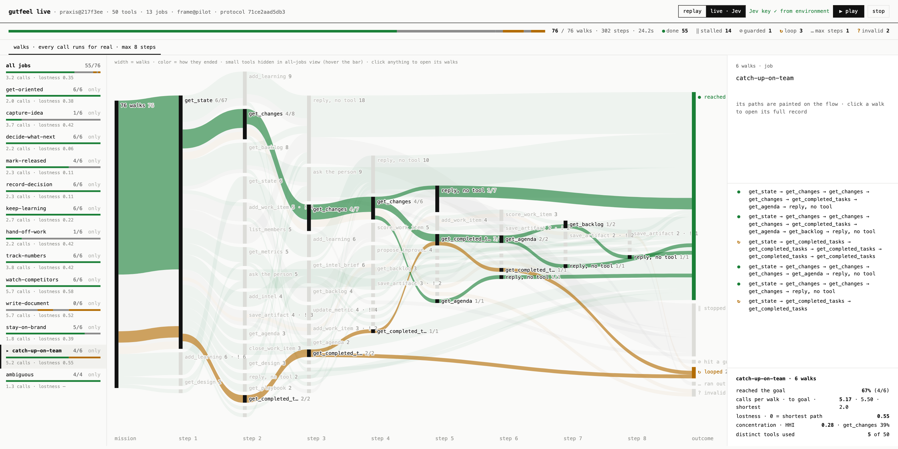

# gutfeel live

A localhost window onto a run. Press play and watch the participant walk your tools, one decision at a time:
- the ramification graph grows from the server to the jobs to the tools
- a dot travels along each branch as Jev decides
- the side panel shows the probabilities of the decision being made right now



```bash
# key from the environment, so the page only shows ▶ play
OPENROUTER_API_KEY=sk-or-...  bun packages/live/server.ts --dir <run folder> --open
TYPESAFE_API_KEY=...          bun packages/live/server.ts --dir <run folder> --open

# no key: replay a recorded run (events.jsonl in the folder)
bun packages/live/server.ts --dir <run folder> --open
```

A run folder holds `surface.json`, `missions.json`, a frozen `protocol.json` and optionally `jobmap.json` and `events.jsonl`. The server refuses to start if the surface or the missions differ from what the protocol froze.

> [!WARNING]
> Walks run every call for real. Use a sandbox or test environment, never production data. The page asks you to confirm before a live walk starts.

**Modes**
- **live** asks Jev for real.
- **replay** plays back a recorded run, re-judged under the current protocol. Use it for demos and GIFs.

**Views**
- **all tools visible**: every tool is shown in full.
- **search · top 5 visible**: the participant only sees what a keyword search over the user's own words returns, the way Claude Code loads tools on demand.

**The key** comes from the environment or from the page. It stays in the server process's memory for one run, and it's never sent back to the browser, logged or written to disk.

This is the first piece of the runner described in [DESIGN.md](../../docs/DESIGN.md). The `npx gutfeel` entry point, which builds the run folder from an MCP server you already have configured, comes next.
